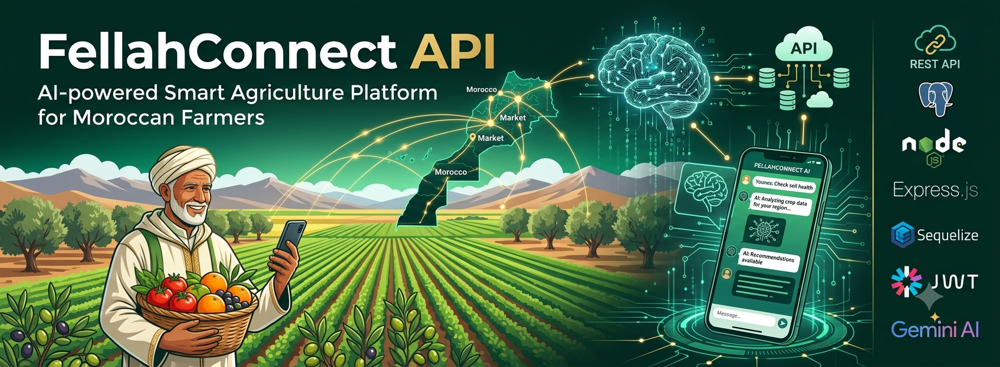

# 🌱 FellahConnect API

> AI-powered Smart Agriculture Platform for Moroccan Farmers 🇲🇦



## 📖 About

FellahConnect API is a RESTful backend application designed to help Moroccan farmers manage their farms, harvests, market prices, and sales.

The platform integrates an AI conversational assistant capable of answering questions and performing actions using Function Calling with Google Gemini or DeepSeek.

Example:

> "I have 300 kg of tomatoes ready. Where should I sell them for the best price?"

The AI assistant compares market prices, recommends the best market, and can create a sale offer after user confirmation.

---

## 🚀 Features

- 👨‍🌾 Farmer Management
- 🌾 Farm & Parcel Management
- 🍅 Product Management
- 📦 Harvest Tracking
- 💰 Market Price Monitoring
- 🛒 Sale Offers
- 🔐 JWT Authentication
- 🛡️ Role-Based Access Control (RBAC)
- 🤖 AI Agent with Function Calling
- 📊 Optimized PostgreSQL Database

---

## 🛠 Tech Stack

| Layer | Technology |
|--------|------------|
| Runtime | Node.js |
| Framework | Express.js |
| Database | PostgreSQL |
| ORM | Sequelize |
| Authentication | JWT + bcrypt |
| AI | Google Gemini / DeepSeek |
| Testing | Postman |

---

## 📂 Project Structure

```text
fellahconnect-api/
│
├── src/
│   ├── config/
│   │   ├── database.js
│   │   ├── gemini.js
│   │   └── env.js
│   │
│   ├── controllers/
│   │   ├── auth.controller.js
│   │   ├── farmer.controller.js
│   │   ├── landPlot.controller.js
│   │   ├── product.controller.js
│   │   ├── harvest.controller.js
│   │   ├── market.controller.js
│   │   ├── marketPrice.controller.js
│   │   ├── saleOffer.controller.js
│   │   └── ai.controller.js
│   │
│   ├── models/
│   │   ├── User.js
│   │   ├── Farmer.js
│   │   ├── LandPlot.js
│   │   ├── Product.js
│   │   ├── Harvest.js
│   │   ├── Market.js
│   │   ├── MarketPrice.js
│   │   ├── SaleOffer.js
│   │   ├── index.js
│   │   └── associations.js
│   │
│   ├── routes/
│   │   ├── auth.routes.js
│   │   ├── farmer.routes.js
│   │   ├── landPlot.routes.js
│   │   ├── product.routes.js
│   │   ├── harvest.routes.js
│   │   ├── market.routes.js
│   │   ├── marketPrice.routes.js
│   │   ├── saleOffer.routes.js
│   │   ├── ai.routes.js
│   │   └── index.js
│   │s
│   ├── middlewares/
│   │   ├── auth.middleware.js
│   │   ├── role.middleware.js
│   │   ├── validate.middleware.js
│   │   └── error.middleware.js
│   │
│   ├── services/
│   │   ├── auth.service.js
│   │   ├── harvest.service.js
│   │   ├── market.service.js
│   │   ├── ai.service.js
│   │   └── dashboard.service.js
│   │
│   ├── utils/
│   │   ├── apiResponse.js
│   │   └── logger.js
│   │
│   ├── validators/
│   │   ├── auth.validator.js
│   │   ├── harvest.validator.js
│   │   └── product.validator.js
│   │
│   ├── app.js
│   └── server.js
│
├── migrations/
├── seeders/
├── tests/
│   ├── postman/
│   └── api/
│
├── docs/
│   ├── UML.png
│   ├── CONCEPTION.md
│   └── API.md
│
├── .env
├── .env.example
├── .gitignore
├── package.json
├── README.md
└── docker-compose.yml (optional)
```

---

## ⚙️ Installation

```bash
git clone git@github.com:Ouhfi/fellahconnect-api.git

cd fellahconnect-api

npm install
```

---

## 🔧 Environment Variables

Create a `.env` file.

Example:

```env
PORT=3000

DB_HOST=localhost
DB_PORT=5432
DB_NAME=fellahconnect
DB_USER=postgres
DB_PASSWORD=password

JWT_SECRET=your_secret

GEMINI_API_KEY=your_api_key
```

---


## 🐳 Docker

### Build the containers

```bash
docker compose up --build
```

### Start containers

```bash
docker compose up -d
```

### Stop containers

```bash
docker compose down
```

### View logs

```bash
docker compose logs -f
```


## 🗄 Database

Run migrations

```bash
docker compose exec api npx sequelize-cli db:migrate
```

Run seeders

```bash
docker compose exec api npx sequelize-cli db:seed:all
```

## ▶️ Run Project

Start the application

```bash
docker compose up
```

The API will be available at

```
http://localhost:3000
```

---

## 🔐 Authentication

### Register

```
POST /auth/register
```

### Login

```
POST /auth/login
```

Returns

```
JWT Token
```

---

## 📌 Main Endpoints

### Farmers

```
GET /agriculteurs
POST /agriculteurs
PUT /agriculteurs/:id
DELETE /agriculteurs/:id
```

### Parcels

```
GET /parcelles
POST /parcelles
```

### Products

```
GET /produits
POST /produits
```

### Harvests

```
GET /recoltes
POST /recoltes
PUT /recoltes/:id
DELETE /recoltes/:id
```

### Market Prices

```
GET /prix-marche
POST /prix-marche
```

### Sale Offers

```
GET /offres
POST /offres
```

---

## 🤖 AI Agent

The AI assistant can:

- Compare market prices
- Find the best market
- Create harvests
- Create sale offers
- Answer questions in natural language
- Respect RBAC permissions
- Ask confirmation before write operations

---

## 📬 Example Conversation

```
👨‍🌾 Farmer:

I have 300 kg of tomatoes.

🤖 AI:

The best market today is Casablanca at 7 DH/kg.

Would you like me to create a sale offer?

👨‍🌾 Farmer:

Yes.

🤖 AI:

Done! Your sale offer has been successfully created.
```

---

## 👥 Team

| Name | Role |      |
|------|------|------|
Oussama	|Tech Lead |  Architecture, AI Agent, Code Review
khadija | Database |REST API, Controllers, Business Logic
Aya | Backend | Database Design, Sequelize, Migrations
marouan|Security & QA |Authentication, Testing, Documentation

---

## branches 

|Branches|
|--------|
main|
develop|
feature/database|
feature/api|
feature/auth|
feature/ai|
## 📄 License

This project was developed as part of a school project in collaboration with **FellahConnect**.
